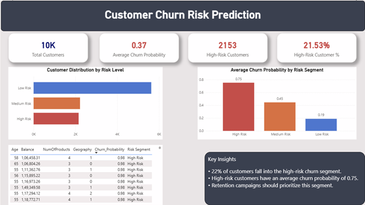

# 🏦 Retail Banking Customer Churn Intelligence Platform

[](https://www.python.org/)
[](https://streamlit.io/)
[](https://scikit-learn.org/)
[](https://plotly.com/)
[](https://powerbi.microsoft.com/)

An executive-grade, end-to-end customer churn analytics platform and machine learning decision system for retail banking. This system combines **predictive AI models**, **portfolio risk intelligence**, **real-time "what-if" simulations**, **high-value at-risk targeting**, and an **interactive campaign ROI calculator**.

---

---

## 📊 Dashboard Previews

| Executive Overview | Customer Churn Analysis |
|:---:|:---:|
|  |  |

| Machine Learning Risk Prediction |
|:---:|
|  |

---

## ⚡ Methods to Run the Platform

You can run this platform using any of the following methods:

### 1. 🚀 Windows Silent 1-Click (`launch_silent.vbs`) — *Recommended*
Double-click **`launch_silent.vbs`**.
- Launches the platform in the background and opens your browser directly **without keeping an open black CMD window**.

### 2. 🪟 Windows Batch File (`run_dashboard.bat`)
Double-click **`run_dashboard.bat`**.
- Starts the server and opens the browser with live logging.

### 3. 💻 PowerShell Script (`run_dashboard.ps1`)
Right-click **`run_dashboard.ps1`** -> *Run with PowerShell*, or execute:
```powershell
powershell -ExecutionPolicy Bypass -File .\run_dashboard.ps1
```
- Performs automated Python & package health checks, auto-installs any missing libraries, and launches the app.

### 4. 🐍 Python Script Launcher (`run_dashboard.py`)
```bash
python run_dashboard.py
```
- Starts the server and automatically opens your default web browser to `http://localhost:8501`.

### 5. ⌨️ Standard Streamlit CLI Command
```bash
streamlit run app.py
```

### 6. 🐳 Docker Container
```bash
docker build -t churn-platform .
docker run -p 8501:8501 churn-platform
```

---

### 🛑 How to Stop the Server
Simply double-click **`stop_dashboard.bat`** to cleanly shut down any running instance on port 8501.

---

## 🌟 Key Platform Modules

### 1. 📊 Executive Overview & Portfolio Health
- **Live KPI Metrics**: Total Customer Base (10,000), Historical Churn Rate (20.37%), Total Portfolio Capital ($764.8M), and Lost Churn Capital ($185.6M).
- **Multi-Dimensional Portfolio Filters**: Dynamic slicing across Geography (France, Germany, Spain), Gender, Age Tiers, and Active Member status.
- **Geographic & Demographic Risk Heatmaps**: Uncovers that **German clients churn at 32.4%** (more than double France and Spain) and customers aged 50+ exhibit steep churn acceleration.
- **Product Holding U-Curve**: Identifies that holding **2 products is the retention sweet spot** (7.6% churn), while customers with 3 or 4 products churn at catastrophic rates (82% to 100%).

### 2. 🧠 Machine Learning & Risk Diagnostics
- **Balanced Random Forest Classifier** (200 estimators, max depth 8, class-weight balancing).
- **ROC-AUC of 0.864** demonstrating exceptional discriminative ability between loyal and churn-prone clients.
- **Interactive Decision Threshold Slider**: Allows risk officers to dynamically tune the classification threshold, trading off precision vs recall.
- **Optimal F1-Score**: 0.629 at optimal decision threshold of ~0.538.
- **Feature Importance Breakdown**: Quantifies top drivers — Age (35.9%), Number of Products (23.9%), Balance (10.2%), Active Member Status (6.1%), and German Geography (5.5%).

### 3. 🔮 Real-Time Customer Churn Simulator ("What-If" Predictor)
- Interactive profile sliders for **Credit Score, Country, Age, Tenure, Balance, Products, Activity, and Salary**.
- Dynamic **Speed Gauge Chart** showing real-time predicted churn probability.
- Automatic classification into 3 tiered risk categories:
  - 🔴 **High Risk** ($\ge 56.5\%$)
  - 🟡 **Medium Risk** ($35.0\% - 56.5\%$)
  - 🟢 **Low Risk** ($< 35.0\%$)
- **Prescriptive Retention Playbook**: Generates custom automated banking interventions (e.g., VIP relationship manager assignment, German branch loyalty perks, second-product incentives).

### 4. 🎯 High-Value At-Risk Customer Explorer ("Save the Whales")
- Filter and prioritize the highest-balance customers who have high churn probabilities.
- Searchable table across 10,000 records by Customer ID or Surname.
- **1-Click CSV Export**: Instant generation of prioritized outreach lists (`bank_retention_priority_list.csv`) for relationship managers.

### 5. 💼 Financial Impact & Campaign ROI Calculator
- Models the financial return of executing proactive retention outreach.
- Real-time simulation of:
  - Targeted customer accounts & deposit capital protected ($)
  - Campaign expenditure vs. Preserved net interest margin
  - Net Economic Value saved & Projected Campaign ROI %

---

## 📂 Project Structure

```
customer-churn-analytics-main/
│
├── app.py                     # Main Streamlit Executive Dashboard
├── run_dashboard.py           # Python launcher with automatic browser opening
├── run_dashboard.bat          # Windows 1-Click launcher
├── README.md                  # Project documentation & architecture
│
├── src/                       # Modular Python source code
│   ├── __init__.py
│   ├── data_processing.py     # Data pipeline & feature engineering
│   ├── model_engine.py        # ML training, evaluation & recommendations
│   └── ui_components.py       # Custom CSS styling, KPI cards & Plotly charts
│
├── data/
│   └── Churn_Modelling.xlsx   # 10,000 customer banking dataset
│
├── model/
│   ├── churn_model_training.py # Original training script
│   ├── rf_churn_model.joblib  # Serialized trained model
│   └── model_metrics.joblib   # Cached evaluation metrics & ROC curves
│
├── powerbi/
│   └── Dashboard.pbix         # Original Power BI dashboard report
│
└── images/                    # Visual assets & dashboard previews
    ├── dashboard_overview.png
    ├── Churn_Analysis.png
    └── Churn_Risk_Prediction_usingML.png
```

---

## 📊 Dataset Reference

The project leverages the **Bank Customer Churn Modelling Dataset**:
- **Total Records**: 10,000 customers
- **Target Variable**: `Exited` (1 = Churned, 0 = Retained)
- **Key Features**:
  - `CreditScore`, `Geography`, `Gender`, `Age`, `Tenure`
  - `Balance`, `NumOfProducts`, `HasCrCard`, `IsActiveMember`, `EstimatedSalary`

---

## 💡 Key Business Takeaways
1. **Target Germany Aggressively**: German clients have double the average churn rate despite maintaining high average balances.
2. **Promote the 2-Product Sweet Spot**: Customers with only 1 product have a 27.7% churn rate, but adding a second product drops churn to 7.6%.
3. **Age 45-60 Intervention**: Middle-aged customers represent the highest volume and rate of churn; targeted wealth advisory and retirement plans are critical.
4. **Re-activate Inactive Accounts**: Non-active members churn at nearly double the rate of active members. Simple automated reminders and digital banking perks yield high retention dividends.

---

## 👤 Author

**Namburu Venkata Subrahmanya Deepak**
- [LinkedIn Profile](https://www.linkedin.com/in/namburu-venkata/)
- [GitHub Profile](https://github.com/Deepak-369-subbu)
